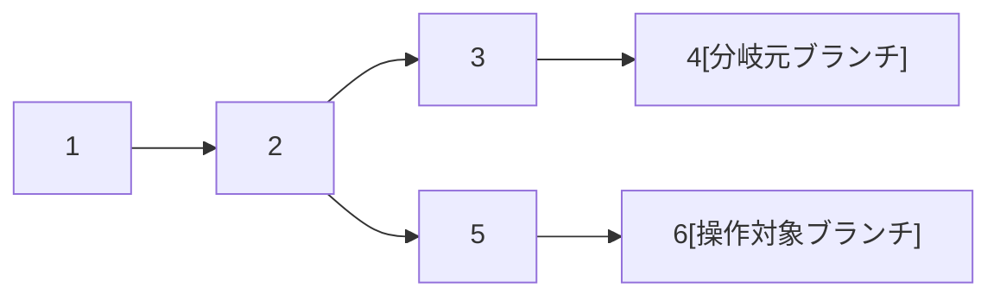
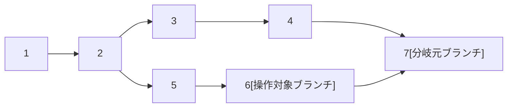
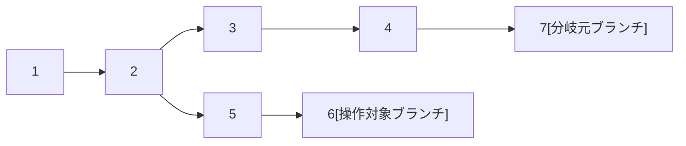
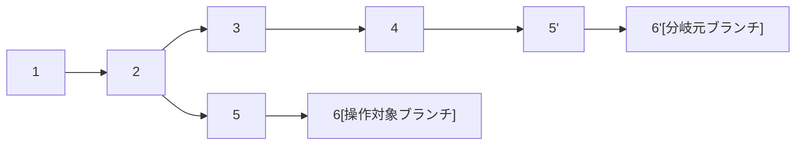

# rebaseとmergeの使い分け

## 前提

rebaseとは、ブランチの分岐元を移動すること。  
以下は操作対象ブランチを分岐元ブランチの最新のコミットにrebaseした例。

mergeとは、ブランチ間の差分を表すコミットを追加して統合すること。  
以下は操作対象ブランチを分岐元ブランチにmergeした例。

squash and merge とは、ブランチ間の差分を表すコミットを新しく作成すること。  
以下は操作対象ブランチを分岐元ブランチに squash and merge した例。

rebase and merge とは、ブランチ間の差分だけコミットを追加すること。  
以下は操作対象ブランチを分岐元ブランチに rebase and merge した例。

git flow のmasterやdevelopおよび GitHub flow のmasterをメインブランチと呼び、それ以外をサポートブランチと呼ぶ。

## 方針

以下の方針で使い分ける。

- サポートブランチから git flow のdevelopや GitHub flow のmasterにマージする -> squash and merge
    - コミットログが見やすい
    - レビュー対応コミットのようなノイズが無くなる
    - 1プルリクエスト1コミットなのでrevertしやすい
- git flow のdevelopからmasterにマージする場合など、同じブランチ間で同じ方向に複数回マージする -> merge
    - それ以外の方法だとマージ元のブランチにマージした履歴が残らないので、2回目のマージ時にコンフリクトが発生する
- すでにプルリクエストを作成したサポートブランチに分岐元ブランチの最新のコミットを取り込む -> merge
    - rebaseして force push すると過去のレビューが紐づかなくなる
- ローカルで開発中のサポートブランチに分岐元ブランチの最新のコミットを取り込む -> rebase
    - コミットログが見やすくなるのでレビューしやすい
